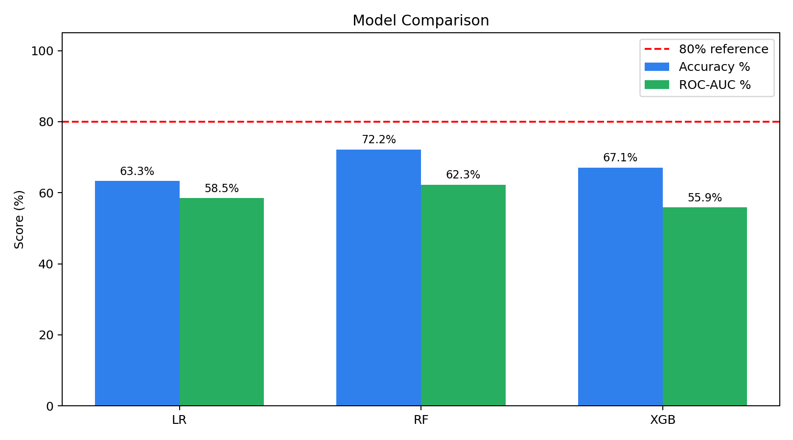
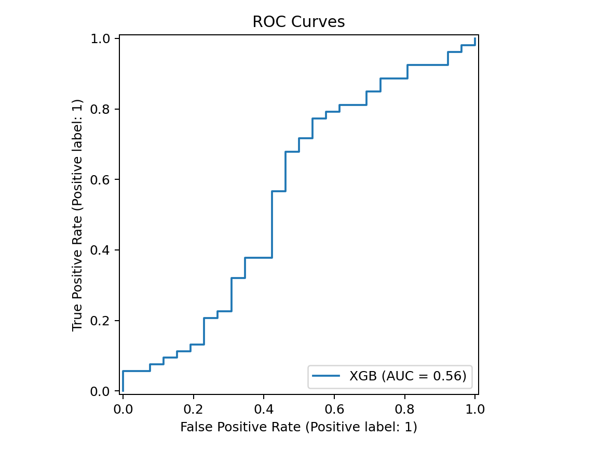
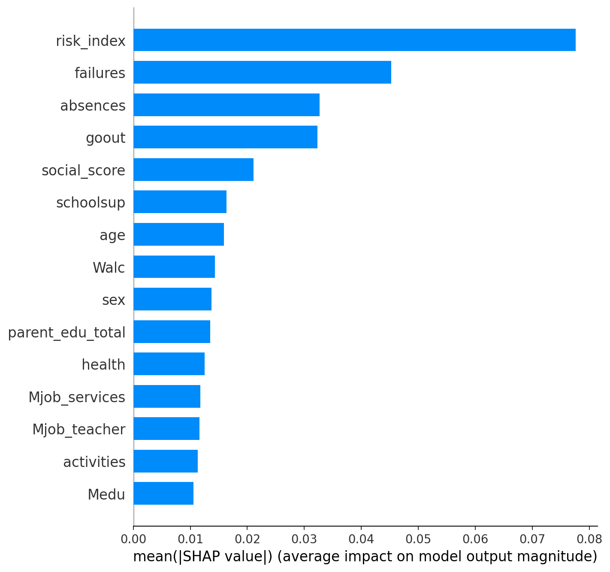
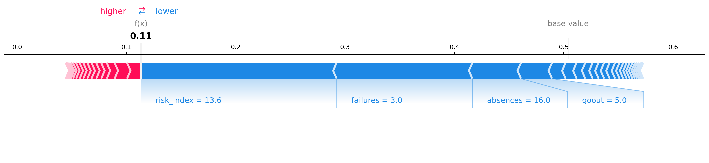

# Student Early Warning System

## Problem
Schools need an early, explainable way to identify students who may fail before final grades are available. This project predicts whether a student passes mathematics using demographic, school, support, attendance, and behavior features from the UCI Student Performance Dataset.

## Real-world impact
An early warning system can help teachers and counselors prioritize support, reduce late interventions, and focus conversations on actionable signals such as absences, prior failures, study time, and support access. The model intentionally excludes `G1`, `G2`, and `G3` as features to avoid grade leakage.

### Tech Stack
Python, Pandas, Scikit-learn, XGBoost, SHAP, SQLAlchemy, Streamlit

## Project architecture (text diagram showing pipeline)
```text
student-warning-system/
├── data/
│   ├── student-mat.csv
│   ├── students.db
│   ├── model_comparison.png
│   ├── shap_global_importance.png
│   ├── shap_dot_plot.png
│   └── shap_force_plot.png
├── notebooks/
│   ├── 01_eda.ipynb
│   ├── 02_sql.ipynb
│   ├── 03_model.ipynb
│   └── 04_shap.ipynb
├── src/
│   ├── etl.py
│   ├── database.py
│   ├── model.pkl
│   ├── scaler.pkl
│   ├── explainer.pkl
│   └── feature_cols.pkl
├── app.py
├── requirements.txt
└── README.md
```

## Pipeline:
Raw CSV -> ETL (`src/etl.py`) -> SQLite DB -> SQL Analytics -> ML Model -> SHAP -> Streamlit

## Project screenshots
### Model comparison


### ROC curves


### SHAP global importance


### SHAP force plot


## 4 engineered features with explanation of each
`parent_edu_total`: Adds mother and father education levels to represent total household education exposure.

`social_score`: Adds going-out frequency and free time to summarize social availability and possible study tradeoffs.

`has_support`: Flags whether a student has school or family educational support.

`risk_index`: Combines prior failures, absences, and low study time into a compact risk signal.

## SQL queries — list all 5 with concept used
`q1_pass_rate_by_studytime`: Aggregation and grouping by study time.

`q2_high_risk_students`: Filtering, ordering, and limiting high-risk records.

`q3_grade_by_parent_edu`: Parent education grouping with average risk and pass rate.

`q4_absence_impact`: CASE bucketing for absence ranges.

`q5_student_ranking`: Window function using `RANK()` within study-time groups.

## Model results table:
| Model | Accuracy | ROC-AUC | Fail Recall |
|---|---:|---:|---:|
| LR | 63.3% | 58.5% | 34.6% |
| RF | 72.2% | 62.3% | 34.6% |
| XGB | 67.1% | 55.9% | 38.5% |
| Tuned RF | 72.2% | 59.3% | 34.6% |

## Why Random Forest was selected
Random Forest was selected because it gave the best baseline accuracy, supports `class_weight='balanced'`, works well with mixed numeric and encoded categorical features, and integrates cleanly with tree-based SHAP explanations. GridSearchCV was optimized for recall to reflect the early-warning goal.

## How to run (step by step commands)
```bash
cd student-warning-system
python -m pip install -r requirements.txt
python src/etl.py
python src/train_model.py
python src/shap_analysis.py
streamlit run app.py
```

Open the Streamlit URL shown in the terminal.

## Dataset credit (UCI)
Dataset: UCI Student Performance Dataset.

Source: https://archive.ics.uci.edu/dataset/320/student+performance

Citation: Cortez, P. and Silva, A. M. G. (2008). Using data mining to predict secondary school student performance.
